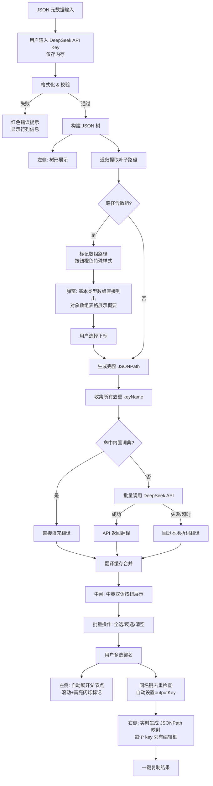

## 用户需求

构建一个三栏布局的网页工具，用于从抖音 JSON 元数据中抽取指定字段并生成 JSONPath 映射配置。

## 产品概述

一款纯前端 JSON 路径抽取工具，帮助用户快速从复杂的抖音 API 返回数据中提取目标字段，自动生成 JSONPath 映射表达式。无需任何后端服务，全部在浏览器中完成。

## 核心功能

### 1. 左侧面板 — JSON 输入与格式化展示

- 提供大文本输入框，用户粘贴原始 JSON 元数据
- 点击【格式化】按钮后，对 JSON 进行校验和格式化
- **重新格式化**：如果当前已有选中的字段，重新点击格式化会弹出确认提示"将清空当前所有选择，确定？"，确认后清空三态状态、重置中间面板和右侧输出
- **值截断**：树形展示中，字符串值超过 100 字符时自动截断，显示"前 100 字符..."，hover 时 tooltip 展示完整值
- 格式化后的 JSON 以可折叠的**树形结构**展示，清晰呈现数据的层级关系与值类型（字符串/数字/布尔/空值用不同颜色标注）
- **错误处理**：如果粘贴的不是合法 JSON，红色边框高亮文本框，并在下方显示具体错误原因（如第几行、什么错误），阻止继续执行
- **空状态引导**：初始状态（未格式化前），中间面板显示 `← 请先在左侧粘贴 JSON 并点击格式化`，右侧面板显示 `← 请在中间选择要抽取的字段`，避免空白面板造成困惑

### 2. 中间面板 — 键名选择器

- **自动路径解析**：遍历格式化后的 JSON 树，提取所有叶子节点（非对象、非数组的值节点）的完整 JSONPath
- **中英双语按钮**：每个路径节点以按钮形式展示，格式为 `英文键名--中文翻译`（如 `nickname--作者昵称`）
- **三态交互**：采用"预览 → 选中 → 取消"三态模型确保数据正确性：
- 状态1（默认）：灰色边框，未选中，不加入右侧输出
- 状态2（预览中）：蓝色虚线边框 + 轻微闪烁，左侧已高亮追踪，不加入右侧输出
- 状态3（已选中）：蓝色实心填充，已加入右侧输出
- 流转：点击默认→预览中，点击预览中→已选中，点击已选中→默认
- **预览互斥**：同一时间只有一个按钮处于"预览中"状态。点击新按钮时，上一个预览按钮自动恢复为默认状态，确保左侧高亮追踪始终指向唯一目标
- **防连点**：按钮点击加 200ms 节流，防止快速双击直接跳过状态
- **搜索筛选**：顶部搜索框支持按英文键名或中文翻译实时过滤。**搜索触发时自动取消当前预览状态**——若搜索导致当前预览按钮被隐藏，预览状态、左侧高亮、滚动定位均重置为默认
- **批量操作**：搜索框旁边提供 `全选`（选中当前可见字段）、`反选`（反转当前可见字段选中状态）、`清空`（取消所有选中）三个快捷按钮
- **翻译机制**（DeepSeek API 批量翻译 + 内置词典兜底）：
- 页面顶部提供 **API Key 输入框**，用户自行填入 DeepSeek API Key（仅存储在浏览器内存中，不持久化、不上传）
- 格式化 JSON 后，收集所有叶子节点的 `keyName` 去重列表，**一次性批量调用** DeepSeek API 获取中文翻译
- 内置翻译字典覆盖抖音 API 40+ 常用字段作为**第一层缓存**，已命中词典的字段跳过 API 调用
- API 翻译结果与内置词典结果合并，**缓存到浏览器内存**，多次使用不重复请求
- **容错**：API 调用失败或超时（10s）时，未翻译字段回退到本地自动翻译（驼峰/下划线分词 + 词根翻译）
- 中间面板显示翻译进度（如"正在翻译 45/120 个字段..."）
- 页面底部展示完整的翻译对照表（去重：同一 keyName 只显示一条），标注翻译来源（词典/API/本地）
- **左侧高亮联动**：点击中间面板的键名按钮时，左侧 JSON 树中对应的节点自动展开父级路径、滚动到可视区域，并以闪烁高亮动画标记位置
- **同名键去重**：当多个叶子节点有相同键名时，自动在输出 key 前加上父级键名前缀进行区分。去重使用 `outputKey` 检测冲突。每个条目有 `userEdited: boolean` 标记，用户手动编辑过的 outputKey 不会被自动覆盖。**去重优先级**：路径更短的条目保留原始 outputKey，路径更长的加父级前缀
- **数组处理**：当叶子路径经过数组节点时，按钮显示为特殊样式（橙色边框 + `⟳` 图标），点击后弹出对话框：
- **空数组**（如 `cha_list: []`）：按钮置灰不可点击，提示"数组为空，无元素可提取"
- **基本类型数组**（如 `url_list`）：直接列出 `[0] url1`, `[1] url2`...
- **对象数组**（如 `video.bit_rate`）：表格展示每个元素关键字段概要，超过 10 个元素时只展示前 10 条 + "还有 N 项"
- **下标记忆**：用户选择下标后，按钮进入"预览中"状态。若用户取消选中后重新回到该按钮，之前选的下标保留。已选下标的按钮旁显示 ✎ 小图标，点击可重新打开下标选择弹窗

### 核心交互流程：搜 → 看 → 确认 → 选

```
① 搜索：在中间面板搜索框输入中文关键词 → 筛选出中文翻译匹配的按钮
② 预览：点击某个按钮 → 不立即选中，触发左侧高亮联动 → 查看真实值和上下文
③ 确认：用户比对左侧高亮内容 → 确认或换下一个
④ 选择：确认无误后再次点击同一按钮 → 选中 → 右侧追加 JSONPath 映射 → 选错可以再点取消
```

**三态流转规则**：

```
默认(灰边框) --点击-->> 预览中(蓝虚线+闪烁) --点击-->> 已选中(蓝实心) --点击-->> 默认(灰边框)
    左侧无反应              左侧高亮追踪               右侧加入输出              右侧移除
```

**批量操作**（全选/反选）直接设为"已选中"状态，弹确认提示"将跳过预览直接加入输出，确定？"

### 3. 右侧面板 — JSONPath 输出

- 根据用户选中的键名，实时生成标准 JSONPath 映射格式：

```
{
  "fields": {
    "aweme_id": "$.data.aweme_detail.aweme_id",
    "desc": "$.data.aweme_detail.desc",
    "nickname": "$.data.aweme_detail.author.nickname",
    "url_list": "$.data.aweme_detail.video.play_addr_h264.url_list[0]",
    "cover_url_list": "$.data.aweme_detail.video.cover.url_list[0]",
    "digg_count": "$.data.aweme_detail.statistics.digg_count",
    "comment_count": "$.data.aweme_detail.statistics.comment_count",
    "share_count": "$.data.aweme_detail.statistics.share_count"
  }
}
```

- field 的 key **保持元数据原始键名**（即叶子节点的 keyName，不做驼峰转换），同名键自动加父级前缀区分（如上例中两个 `url_list` → `url_list` 和 `cover_url_list`），value 为完整 JSONPath 表达式
- 每个字段旁提供**可编辑输入框**，允许用户手动修改输出的 key 名称
- 输出结果以带语法高亮的代码块展示，无选中字段时显示 `{ "fields": {} }`
- 提供【一键复制】按钮，将输出结果复制到剪贴板

## 技术栈

- **前端框架**：无框架，原生 HTML5 + CSS3 + Vanilla JavaScript（ES6+）
- **部署方式**：单个 HTML 文件，浏览器直接打开即可使用
- **依赖**：DeepSeek API（翻译能力，用户自备 Key；API 不可用时自动回退本地翻译），其余零外部依赖

## 实现方案

### 整体策略

采用**单文件三栏布局**的纯前端方案。左侧为 JSON 输入/树形展示区，中间为键名选择交互区，右侧为结果输出区。核心逻辑包括 JSON 解析与树构建、JSON 校验错误处理、叶子路径递归提取、同名键去重、数组下标选择、中英翻译引擎、左侧高亮联动、JSONPath 生成八个模块。

### 关键设计决策

1. **树形结构渲染**：采用递归 DOM 生成 + CSS 缩进方案，每个节点包含展开/折叠箭头、键名、类型标记和值。每个叶子节点 DOM 元素设置 `data-path` 属性存储其完整 JSONPath，用于高亮联动时的定位。

2. **路径解析策略**：深度优先遍历 JSON 树，遇到叶子节点（非 object、非 array 的值）时记录完整路径。遇到数组节点时，标记该路径需要用户选择下标。**嵌套数组**需要依次弹窗选择每层下标，直到所有数组下标都确定后路径才算完整。

3. **翻译方案**：采用 **DeepSeek API 批量翻译 + 内置词典缓存** 双引擎。流程：格式化 JSON → 提取所有去重 keyName → 内置词典命中直接填充 → 剩余未翻译字段打包为一个 API 请求批量翻译 → API 失败回退本地拆词翻译。API Key 由用户在页面顶部输入框提供，仅存内存、不持久化。翻译结果全量缓存，二次使用零延迟。

4. **数组下标选择交互**：当路径经过数组时，提取数组中每个元素的一级子字段摘要展示在弹窗表格中，用户可直观浏览内容并选择下标索引。

5. **左侧高亮联动**：点击中间键名按钮时，先自动展开该节点的所有父级折叠节点，然后使用**双重 `requestAnimationFrame`**（展开 → rAF → 再 rAF → scrollIntoView）确保浏览器完成 reflow 后再滚动。调用 `scrollIntoView({ behavior: 'smooth', block: 'center' })` 滚动到目标节点，最后添加 CSS 闪烁高亮动画（黄色脉冲背景 + 过渡效果），并在 2 秒后自动移除。

6. **同名键去重**：使用 `outputKey` 检测冲突（而非 `keyName`）。用户手动编辑过的条目设置 `userEdited = true`，自动去重时不会覆盖已编辑的 key。冲突的自动条目以倒数第二级父节点键名作为前缀。**去重优先级**：路径更短的条目保留原始 outputKey，路径更长的加父级前缀（确保稳定性）。去重仅对 `state === 'selected'` 的条目执行。

7. **JSON 校验错误处理**：使用 `try/catch` 包裹 `JSON.parse`，解析失败时捕获错误对象，提取行列信息展示在输入框下方，同时红色边框高亮输入框。只有校验通过后才执行后续的树构建和路径提取。

### 性能考量

- 对于约 200KB 的示例级 JSON，递归遍历和 DOM 渲染在 100ms 内完成
- 搜索过滤使用防抖（debounce 300ms）减少不必要的 DOM 操作
- 树形结构默认只展开前 2 层，避免一次性渲染大量 DOM 节点
- 使用 DocumentFragment 批量插入 DOM，减少回流

### 架构设计



## 核心目录结构

```
d:/vibe coding/005_douyin_plugin_setting/
└── index.html    # [NEW] 单文件应用，包含完整 HTML 结构 + CSS 样式 + JavaScript 逻辑
                   # 功能模块：
                   #   - JSON 格式化与校验
                   #   - 树形结构递归渲染（含节点ID=JSONPath的映射，用于高亮联动）
                   #   - 叶子路径提取与数组处理
                   #   - 中英翻译引擎（DeepSeek API 批量翻译 + 内置词典缓存 + 本地回退）
                   #   - API Key 管理（标题栏输入框，仅内存存储）
                   #   - 键名选择与搜索过滤
                   #   - 左侧高亮联动：点击按钮→自动展开父节点→scrollIntoView→闪烁动画
                   #   - JSONPath 映射生成与复制
                   #   - 响应式三栏布局
```

## 关键代码结构

### JSON 树节点数据结构

```javascript
interface TreeNode {
  key: string;           // 当前层级键名
  path: string;          // 从根到当前节点的完整 JSONPath 路径
  type: 'object' | 'array' | 'string' | 'number' | 'boolean' | 'null';
  value: any;            // 节点值（仅叶子节点有意义）
  children: TreeNode[];  // 子节点（仅对象/数组）
  isLeaf: boolean;       // 是否为叶子节点
}
```

### 叶子路径条目

```javascript
interface LeafPathEntry {
  id: string;                // 唯一标识，基于不含数组下标的基础路径生成
  keyName: string;           // 叶子节点键名（如 "nickname"）
  fullJsonPath: string;      // 完整 JSONPath
  chineseName: string;       // 中文翻译（如 "作者昵称"）
  outputKey: string;         // 去重后的输出 key
  userEdited: boolean;       // 用户是否手动编辑过 outputKey
  state: 'default' | 'previewed' | 'selected';  // 三态
  arrayIndexes: Map<string, number>;  // 数组下标映射
  hasUnresolvedArray: boolean;        // 是否还有未选择下标的数组
}
```

### 内置翻译词典（核心字段，已去重）

```javascript
const TRANSLATION_DICT = {
  // 顶层
  code: '状态码', request_id: '请求ID', message: '消息', time: '时间', router: '路由',
  // aweme_detail
  aweme_id: '作品ID', desc: '描述', caption: '标题', create_time: '创建时间',
  group_id: '分组ID', media_type: '媒体类型', user_digged: '是否点赞',
  // author
  nickname: '作者昵称', uid: '用户ID', sec_uid: '安全UID', short_id: '短ID',
  unique_id: '抖音号', signature: '签名', gender: '性别', region: '地区',
  follower_count: '粉丝数', following_count: '关注数', aweme_count: '作品数',
  total_favorited: '总被赞数', favoriting_count: '收藏数',
  // statistics
  digg_count: '点赞数', comment_count: '评论数', share_count: '分享数',
  download_count: '下载数', collect_count: '收藏数', play_count: '播放数',
  forward_count: '转发数', exposure_count: '曝光数', admire_count: '赞赏数',
  recommend_count: '推荐数', whatsapp_share_count: 'WhatsApp分享数',
  // video
  play_addr: '播放地址', play_addr_h264: 'H264播放地址', cover: '封面',
  origin_cover: '原始封面', dynamic_cover: '动态封面', download_addr: '下载地址',
  width: '宽度', height: '高度', ratio: '分辨率', format: '格式',
  has_watermark: '是否有水印', data_size: '文件大小',
  url_list: 'URL列表', uri: 'URI', file_hash: '文件Hash', url_key: 'URL键',
  // music
  id_str: '音乐ID', title: '标题', author: '作者', owner_nickname: '创作者昵称',
  owner_handle: '创作者抖音号', status: '状态',
  // cha_list
  cha_name: '话题名称', cid: '话题ID', user_count: '参与人数', view_count: '浏览数',
  is_commerce: '是否商业', sub_type: '子类型',
  // share
  share_url: '分享链接', share_title: '分享标题', share_desc: '分享描述',
  // 通用（含多模块共用的同名键，以最通用翻译为准）
  type: '类型', name: '名称', id: 'ID', label: '标签', text: '文本',
  level: '级别', start: '起始位置', end: '结束位置',
  duration: '时长',
  bit_rate: '码率', FPS: '帧率', is_h265: '是否H265', is_bytevc1: '是否ByteVC1',
  gear_name: '档位名称', quality_type: '质量类型', HDR_type: 'HDR类型', HDR_bit: 'HDR码率',
  size: '大小', count: '数量',
};
```

## 设计风格

采用**现代简约 + 功能型工具面板**风格，以深色主题为基础，强调内容层次和操作效率。三栏布局各有明确色块区分，按钮和交互元素使用圆角和微阴影增强质感。

### 整体布局

- 三栏等宽水平布局，最小化间距（8px gutter），最大化内容展示面积
- 顶部通栏标题栏，包含应用名称、API Key 输入框和简要说明
- 每栏内部：标题头 + 内容区 + 底部操作区

### 左侧面板 — JSON 输入区

- 顶部大文本域，等宽字体（Consolas），浅灰背景
- 格式化按钮使用主题色，带 hover 动效
- 下方树形展示区，节点采用缩进 + 连线引导视觉层级，不同类型用不同颜色标记（字符串绿、数字蓝、布尔橙、空值灰）
- 展开/折叠箭头为 CSS 三角形动画

### 中间面板 — 键名选择区

- 顶部搜索框带搜索图标，实时过滤下方按钮
- 按钮采用 tag 风格，圆角矩形：默认浅灰边框、预览中蓝色虚线+闪烁、已选中主题色填充
- 数组待选状态橙色边框 + ⟳ 图标，空数组置灰
- 按钮布局采用 flex-wrap 流式排列
- 底部固定翻译对照表区域，表格形式展示，奇数行浅底色，标注翻译来源

### 右侧面板 — 结果输出区

- JSONPath 结果以代码块展示（深色底 + 语法高亮）
- 一键复制按钮位于代码块右上角，复制成功绿色对勾动画反馈
- 统计信息显示已选字段数量

### 标题栏

- 左侧应用图标 + 名称「抖音 JSON 路径抽取器」
- 右侧 DeepSeek API Key 输入框（password 类型，仅存内存）+ 版本号

## Agent Extensions

### Skill

- **UI/UX Design and Development**
- 用途：生成美观的 HTML/CSS/JS 代码实现，确保整个单页应用在视觉上精致、交互上流畅
- 预期成果：生成可直接使用的完整 index.html 文件，包含三栏布局、树形展示、按钮选择器和 JSONPath 输出等全部功能模块

- **Impeccable（前端设计工具集）**
- 用途：在实现 UI 布局和交互时，确保界面达到高质量设计标准，包括响应式布局、动效微交互、配色方案和视觉层次
- 预期成果：产出符合现代设计审美的三栏工具面板，带流畅的选中/取消动效、优雅的对话框设计、以及干净的信息层级